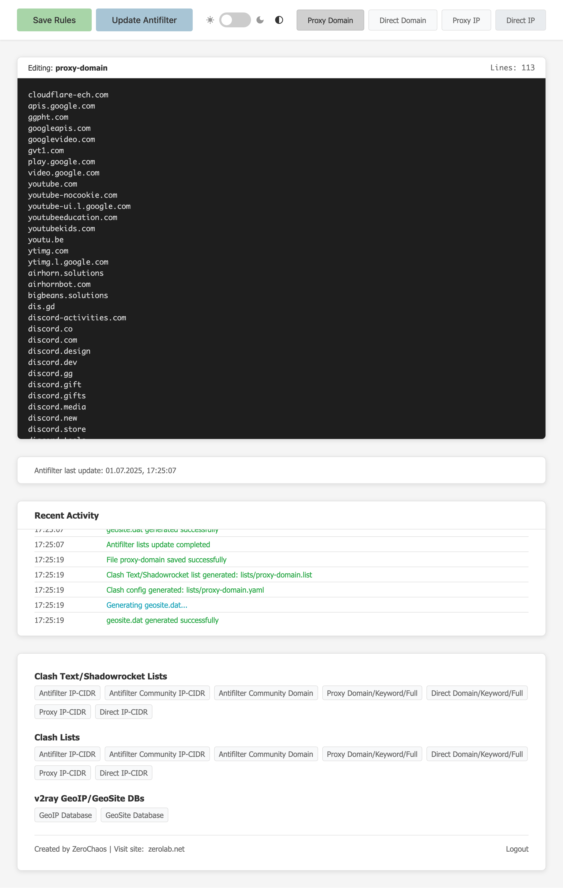

# SSAntifilter

A powerful web-based tool for managing and generating proxy lists from Antifilter sources and custom lists. SSAntifilter automatically downloads, converts, and serves proxy lists in multiple formats including Clash, Shadowrocket, and v2ray GeoIP/GeoSite databases.

---

<p align="center">
 
</p>

## Features

- 🔄 **Automatic Updates**: Downloads fresh lists from Antifilter every 12 hours
- 📝 **Web Editor**: Edit proxy/direct domain and IP lists through a clean web interface
- 🌓 **Dark/Light Theme**: Automatic theme switching based on system preferences
- 📊 **Real-time Logs**: Monitor all operations with live activity logs
- 🔒 **Secure**: Password-protected access with bcrypt encryption
- 📱 **Responsive**: Mobile-friendly interface
- 🚀 **Multiple Formats**:
    - Clash Text lists/Shadowrocket
    - Clash YAML configs
    - v2ray GeoIP/GeoSite databases (.dat files)


## Supported Sources

- **Antifilter IP Lists**: `allyouneed.lst`, `community.lst`
- **Antifilter Domain Lists**: `domains.lst`
- **Custom Lists**: Proxy/Direct domains and IPs


## Quick Start

### Using Docker (Recommended)

#### HTTP Setup

```bash
# Create data directory
mkdir -p /data/ssantifilter/rawdata
chown -R 1000:1000 /data/ssantifilter

# Run container
docker run -d \
  --name ssantifilter \
  --restart=unless-stopped \
  -e PORT=8080 \
  -e SESSION_SECRET_KEY=your-secret-key-here \
  -v /data/ssantifilter/rawdata:/app/rawdata \
  -p 8080:8080 \
  zerolabnet/ssantifilter:latest
```


#### HTTPS Setup with Let's Encrypt

1. **Generate SSL Certificate**:
```bash
docker run --rm -it \
  -v /data/acme:/acme.sh \
  -p 80:80 \
  neilpang/acme.sh \
  --issue --standalone -d ssa.example.com --email email@example.com -k 2048
```

2. **Set Permissions**:
```bash
mkdir -p /data/ssantifilter/rawdata
chown -R 1000:1000 /data/ssantifilter
chown -R 1000:1000 /data/acme/ssa.example.com
```

3. **Run with HTTPS**:
```bash
docker run -d \
  --name ssantifilter \
  --restart=unless-stopped \
  -e PORT=443 \
  -e USE_HTTPS=1 \
  -e HTTPS_CERT_FILE=/acme/fullchain.cer \
  -e HTTPS_KEY_FILE=/acme/ssa.example.com.key \
  -e SESSION_SECRET_KEY=your-secret-key-here \
  -v /data/acme/ssa.example.com:/acme:ro \
  -v /data/ssantifilter/rawdata:/app/rawdata \
  -p 443:443 \
  zerolabnet/ssantifilter:latest
```


### Building from Source

```bash
# Clone repository
git clone https://github.com/zerolabnet/ssantifilter.git
cd ssantifilter

# Build Docker image
docker build --no-cache -t zerolabnet/ssantifilter:latest .

# Run container
docker run -d \
  --name ssantifilter \
  --restart=unless-stopped \
  -e PORT=8080 \
  -e SESSION_SECRET_KEY=your-secret-key-here \
  -v /data/ssantifilter/rawdata:/app/rawdata \
  -p 8080:8080 \
  zerolabnet/ssantifilter:latest
```


## Environment Variables

| Variable | Description | Default | Required |
| :-- | :-- | :-- | :-- |
| `PORT` | Server port | `8080` | No |
| `SESSION_SECRET_KEY` | Session encryption key | Auto-generated | Recommended |
| `USE_HTTPS` | Enable HTTPS (set to `1`) | `0` | No |
| `HTTPS_CERT_FILE` | Path to SSL certificate | - | If HTTPS enabled |
| `HTTPS_KEY_FILE` | Path to SSL private key | - | If HTTPS enabled |

## Usage

1. **Access Web Interface**: Open `http://localhost:8080` (or your domain)
2. **Login**: Use the password shown in container logs on first run
3. **Edit Lists**: Use the web editor to modify proxy/direct domains and IPs
4. **Download Lists**: Access generated lists via the web interface and paste the links into your configuration of a program designed to circumvent blocking

## Available Endpoints

### Clash Text Lists/Shadowrocket

- `/antifilter-ip.list` - Antifilter IP ranges
- `/antifilter-community-ip.list` - Community IP ranges
- `/antifilter-community-domain.list` - Community domains
- `/proxy-domain.list` - Custom proxy domains
- `/direct-domain.list` - Custom direct domains
- `/proxy-ip.list` - Custom proxy IPs
- `/direct-ip.list` - Custom direct IPs


### Clash YAML Configs

- `/antifilter-ip.yaml` - Antifilter IP ranges
- `/antifilter-community-ip.yaml` - Community IP ranges
- `/antifilter-community-domain.yaml` - Community domains
- `/proxy-domain.yaml` - Custom proxy domains
- `/direct-domain.yaml` - Custom direct domains
- `/proxy-ip.yaml` - Custom proxy IPs
- `/direct-ip.yaml` - Custom direct IPs


### v2ray Databases

- `/geoip.dat` - GeoIP database
- `/geosite.dat` - GeoSite database


## File Format Examples

### Domain Lists

```
# Standard domains (Domain suffix matching will be used)
example.com

# With prefixes for advanced matching
domain:example.com      # Domain suffix matching (may be omitted, see above)
keyword:google          # Keyword matching  
full:www.example.com    # Full domain matching
```


### IP Lists

```
# Individual IPs
192.168.1.1
10.0.0.1

# CIDR ranges
192.168.0.0/24
10.0.0.0/8
```


## Data Persistence

The application stores data in `/app/rawdata` inside the container. Mount this directory to persist your custom lists:

```bash
-v /data/ssantifilter/rawdata:/app/rawdata
```


## Security

- All passwords are hashed with bcrypt
- Session cookies are HTTP-only and secure
- File access is restricted to designated directories
- HTTPS support with custom certificates


## Keyboard Shortcuts

- `Ctrl+S` - Save current file
- `Ctrl+U` - Update Antifilter lists


## Troubleshooting

### Container Won't Start

- Check port availability: `netstat -tlnp | grep :8080`
- Verify directory permissions: `ls -la /data/ssantifilter`


### SSL Certificate Issues

- Ensure certificate files are readable by container user (UID 1000)
- Check certificate validity: `openssl x509 -in cert.pem -text -noout`


### Lists Not Updating

- Verify internet connectivity from container
- Ensure sufficient disk space


## Contributing

1. Fork the repository
2. Create a feature branch
3. Make your changes
4. Submit a pull request

## License

This project is licensed under the GPL-2.0 License - see the [LICENSE](LICENSE) file for details.

## Support

- 🐛 **Issues**: [GitHub Issues](https://github.com/zerolabnet/ssantifilter/issues)
- 💬 **Discussions**: [GitHub Discussions](https://github.com/zerolabnet/ssantifilter/discussions)
- 🌐 **Website**: [zerolab.net](https://zerolab.net)


## Acknowledgments

- [Antifilter](https://antifilter.download/) for providing the source lists
- [v2fly](https://github.com/v2fly) for GeoIP and GeoSite tools

**Created by ZeroChaos** | **Visit**: [zerolab.net](https://zerolab.net)
